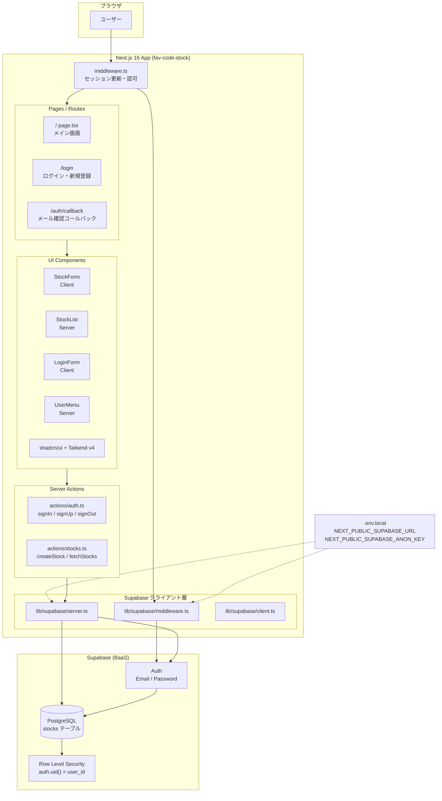
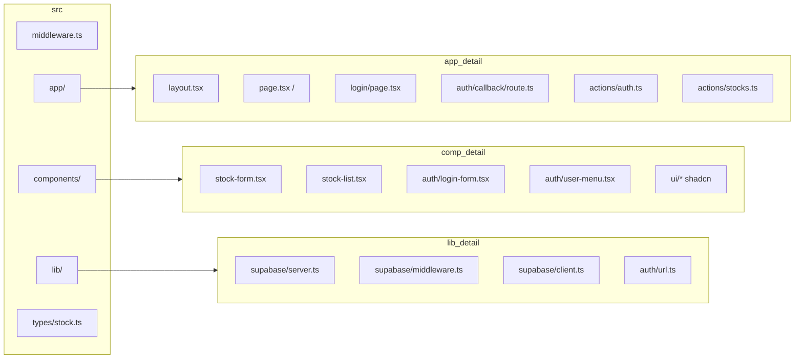
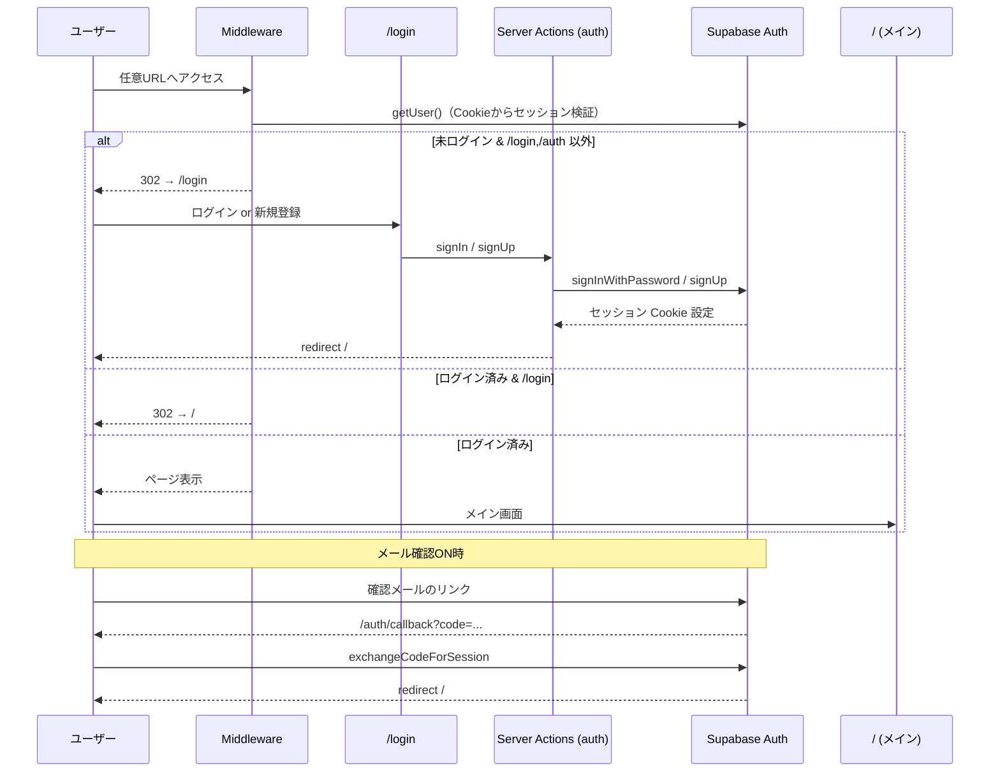
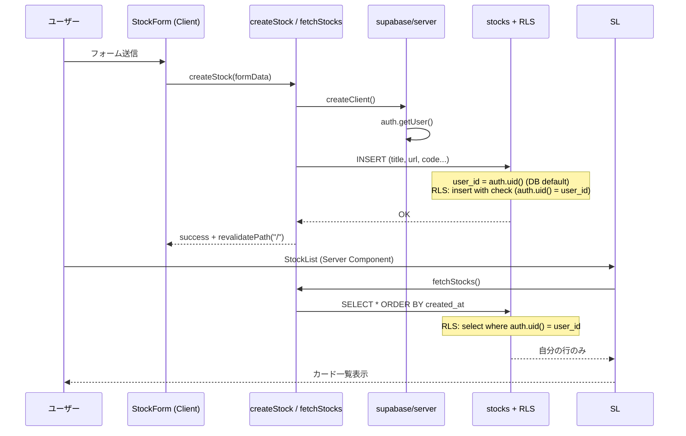
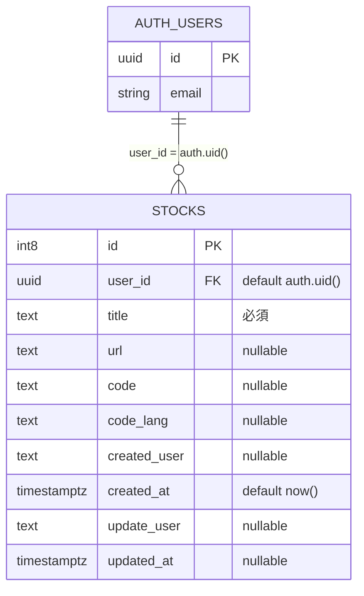
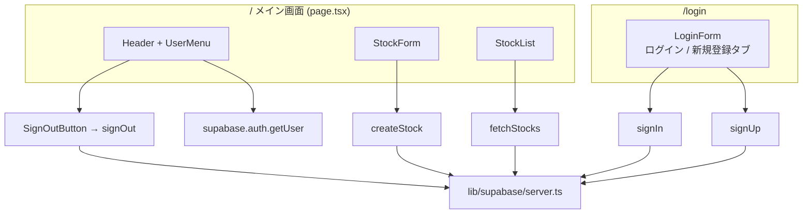

# fav-code-stock システム構成

デベロッパー向けストックサービス（Next.js 16 + Supabase Auth + PostgreSQL）のアーキテクチャ概要です。

## デプロイ環境

| 環境 | URL |
|------|-----|
| 本番（Vercel） | https://fav-code-stock.vercel.app/ |
| ローカル | http://localhost:3000 |

ホスティング: [Vercel](https://vercel.com/)  
バックエンド: Supabase（Auth + PostgreSQL + RLS）

## 技術スタック

| 層 | 技術 |
|----|------|
| フロントエンド | Next.js 16 (App Router), React 19 |
| UI | Tailwind CSS v4, shadcn/ui (base-nova) |
| 認証・DB | Supabase Auth + PostgreSQL |
| サーバー連携 | `@supabase/ssr`（Cookie ベースセッション） |
| データ操作 | Server Actions |
| 保護 | Middleware によるルートガード + RLS |

## 環境変数

`.env.local` に以下を設定します。

```env
NEXT_PUBLIC_SUPABASE_URL=https://xxxx.supabase.co
NEXT_PUBLIC_SUPABASE_ANON_KEY=eyJhbG...
```

本番（Vercel の Environment Variables）:

```env
NEXT_PUBLIC_SITE_URL=https://fav-code-stock.vercel.app
```

ローカル:

```env
NEXT_PUBLIC_SITE_URL=http://localhost:3000
```

---

## 1. 全体アーキテクチャ



---

## 2. ディレクトリ構成

```
fav-code-stock/
├── docs/
│   └── architecture.md          # 本ドキュメント
├── supabase/
│   └── rls-policies.sql         # RLS ポリシー定義
├── src/
│   ├── middleware.ts            # 認証ガード・セッション更新
│   ├── app/
│   │   ├── layout.tsx
│   │   ├── page.tsx             # メイン画面 (/)
│   │   ├── login/page.tsx       # ログイン画面
│   │   ├── auth/callback/route.ts
│   │   └── actions/
│   │       ├── auth.ts          # signIn, signUp, signOut
│   │       └── stocks.ts        # createStock, fetchStocks
│   ├── components/
│   │   ├── auth/                # LoginForm, UserMenu, SignOutButton
│   │   ├── stock-form.tsx
│   │   ├── stock-list.tsx
│   │   └── ui/                  # shadcn/ui
│   ├── lib/
│   │   ├── supabase/
│   │   │   ├── server.ts        # Server Components / Actions 用
│   │   │   ├── middleware.ts    # Middleware 用
│   │   │   └── client.ts        # ブラウザ用（将来の Client 利用向け）
│   │   └── auth/url.ts          # サイト URL 取得（signUp リダイレクト）
│   └── types/stock.ts
└── .env.local
```



---

## 3. ルーティング

| パス | 認証 | 役割 |
|------|------|------|
| `/` | 必須 | ストック登録・一覧 |
| `/login` | 不要（ログイン済みは `/` へリダイレクト） | ログイン・新規登録 |
| `/auth/callback` | 不要 | メール確認後のセッション確立 |

Middleware（`src/middleware.ts`）は全ルート（静的アセット除く）で実行され、`src/lib/supabase/middleware.ts` の `updateSession` で以下を行います。

- セッション Cookie の更新
- 未ログイン → `/login` へリダイレクト（`/login`, `/auth` は除外）
- ログイン済みで `/login` → `/` へリダイレクト

---

## 4. 認証フロー



### Supabase ダッシュボード設定

1. **Authentication → Providers → Email** を有効化
2. **Authentication → URL Configuration**
   - Site URL: `https://fav-code-stock.vercel.app`
   - Redirect URLs（本番・ローカル両方）:
     - `https://fav-code-stock.vercel.app/auth/callback`
     - `http://localhost:3000/auth/callback`
3. 開発時は **Confirm email** を OFF にすると即ログイン可能
4. `supabase/rls-policies.sql` を SQL Editor で実行
5. Vercel に `NEXT_PUBLIC_SUPABASE_URL` / `NEXT_PUBLIC_SUPABASE_ANON_KEY` を設定

---

## 5. ストック登録・一覧フロー



---

## 6. データモデル



### RLS ポリシー

`supabase/rls-policies.sql` で定義。すべて **`auth.uid() = user_id`** です。

| 操作 | ポリシー名 |
|------|------------|
| SELECT | Users can read own stocks |
| INSERT | Users can insert own stocks |
| UPDATE | Users can update own stocks |
| DELETE | Users can delete own stocks |

---

## 7. 画面とコンポーネント



### コンポーネント種別

| コンポーネント | 種別 | 説明 |
|----------------|------|------|
| `StockForm` | Client | `useActionState` + `createStock` |
| `StockList` | Server | `fetchStocks` で一覧取得 |
| `LoginForm` | Client | ログイン / 新規登録タブ切替 |
| `UserMenu` | Server | 表示メール + ログアウト |
| `SignOutButton` | Server | `signOut` Server Action |

---

## 8. 主要ファイル参照

| ファイル | 責務 |
|----------|------|
| `src/middleware.ts` | Middleware エントリポイント |
| `src/lib/supabase/middleware.ts` | セッション更新・リダイレクト判定 |
| `src/lib/supabase/server.ts` | サーバー側 Supabase クライアント |
| `src/app/actions/auth.ts` | 認証 Server Actions |
| `src/app/actions/stocks.ts` | ストック CRUD（現状: 作成・一覧） |
| `src/app/auth/callback/route.ts` | OAuth / メール確認コールバック |
| `src/types/stock.ts` | `Stock` 型定義 |

---

## 9. 今後の拡張候補

- ストックの編集・削除 UI
- タグ検索・全文検索
- Supabase Realtime による一覧のリアルタイム更新
- OAuth プロバイダ（GitHub 等）の追加
