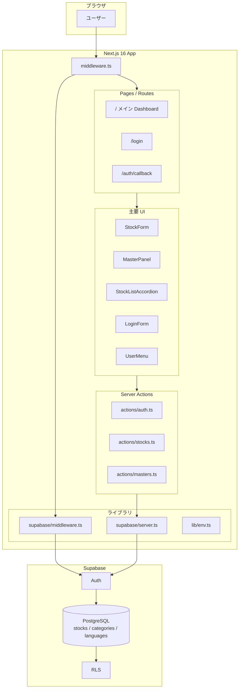
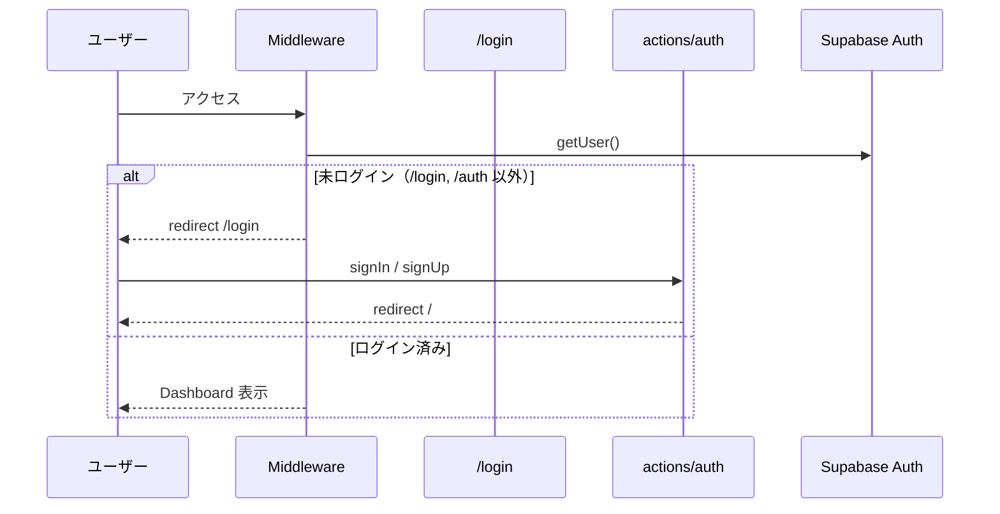
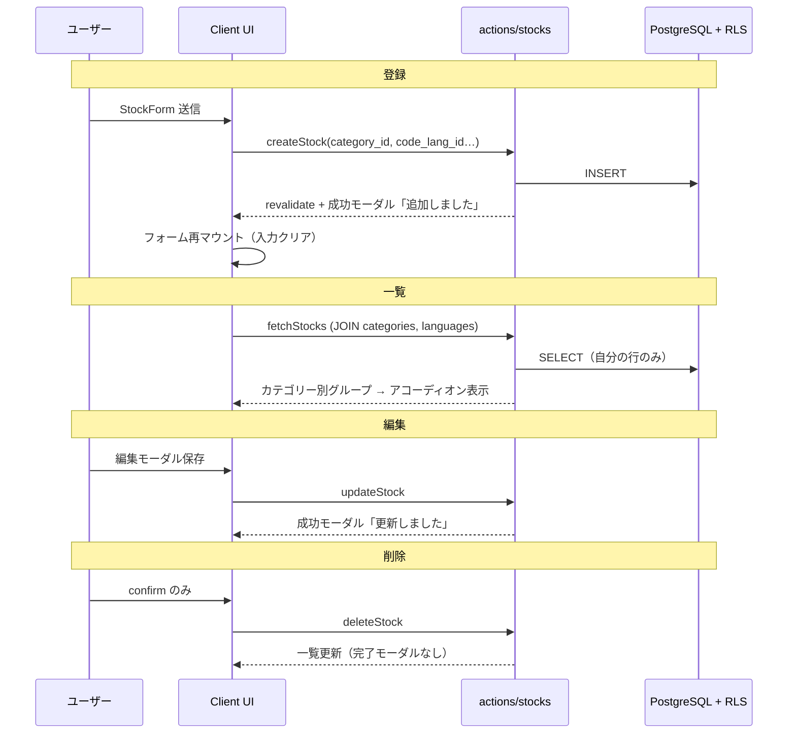
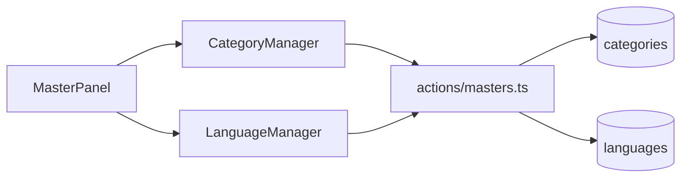
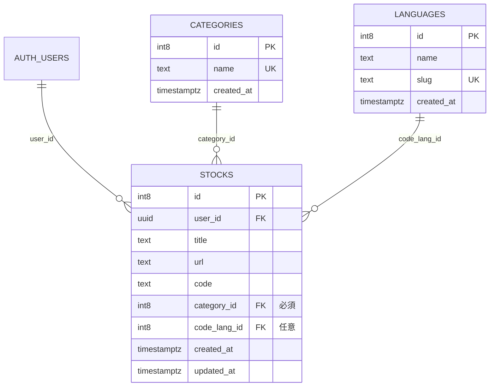

# fav-code-stock システム構成

デベロッパー向けストックサービス（Next.js 16 + Supabase Auth + PostgreSQL）のアーキテクチャ概要です。

## デプロイ環境

| 環境 | URL | 画面タイトル |
|------|-----|----------------|
| 本番（Vercel） | https://fav-code-stock.vercel.app/ | `Developer Stock` |
| ローカル / Preview | http://localhost:3000 等 | `Developer Stock（開発）` + DEV バッジ |

ホスティング: [Vercel](https://vercel.com/)  
バックエンド: Supabase（Auth + PostgreSQL + RLS）

## 技術スタック

| 層 | 技術 |
|----|------|
| フロントエンド | Next.js 16 (App Router), React 19 |
| UI | Tailwind CSS v4, shadcn/ui (base-nova) |
| 認証・DB | Supabase Auth + PostgreSQL |
| サーバー連携 | `@supabase/ssr`（Cookie ベースセッション） |
| データ操作 | Server Actions |
| 保護 | Middleware によるルートガード + RLS |

## 環境変数

`.env.local` に以下を設定します。

```env
NEXT_PUBLIC_SUPABASE_URL=https://xxxx.supabase.co
NEXT_PUBLIC_SUPABASE_ANON_KEY=eyJhbG...
```

本番（Vercel の Environment Variables）:

```env
NEXT_PUBLIC_SITE_URL=https://fav-code-stock.vercel.app
```

ローカル:

```env
NEXT_PUBLIC_SITE_URL=http://localhost:3000
```

本番/開発の判定は `src/lib/env.ts`（`VERCEL_ENV === "production"` のみ本番）で行います。

---

## 1. 全体アーキテクチャ



---

## 2. ディレクトリ構成

```
fav-code-stock/
├── docs/
│   └── architecture.md
├── supabase/
│   ├── rls-policies.sql              # stocks 用 RLS（初回）
│   └── migrations/
│       └── 002_categories_languages.sql  # マスタ + stocks FK 移行
├── src/
│   ├── middleware.ts
│   ├── app/
│   │   ├── layout.tsx
│   │   ├── page.tsx                  # Dashboard
│   │   ├── login/page.tsx
│   │   ├── auth/callback/route.ts
│   │   └── actions/
│   │       ├── auth.ts
│   │       ├── stocks.ts             # CRUD
│   │       └── masters.ts            # カテゴリー・言語マスタ CRUD
│   ├── components/
│   │   ├── auth/
│   │   ├── app-branding.tsx          # 環境別タイトル
│   │   ├── stock-form.tsx
│   │   ├── stock-fields.tsx          # 登録・編集共通フィールド
│   │   ├── stock-list.tsx
│   │   ├── stock-list-accordion.tsx  # カテゴリー別アコーディオン
│   │   ├── stock-card.tsx
│   │   ├── edit-stock-button.tsx
│   │   ├── delete-stock-button.tsx
│   │   ├── action-feedback-dialog.tsx
│   │   ├── master-panel.tsx
│   │   ├── category-manager.tsx
│   │   ├── language-manager.tsx
│   │   └── ui/                       # shadcn (button, card, dialog, accordion…)
│   ├── lib/
│   │   ├── env.ts
│   │   ├── supabase/
│   │   └── auth/url.ts
│   └── types/
│       ├── stock.ts
│       ├── category.ts
│       └── language.ts
└── .env.local
```

---

## 3. ルーティング

| パス | 認証 | 役割 |
|------|------|------|
| `/` | 必須 | ストック登録・マスタ管理・カテゴリー別一覧 |
| `/login` | 不要（ログイン済みは `/` へ） | ログイン・新規登録 |
| `/auth/callback` | 不要 | メール確認後のセッション確立 |

---

## 4. 認証フロー



### Supabase ダッシュボード設定

1. `supabase/rls-policies.sql` を実行（初回・stocks）
2. `supabase/migrations/002_categories_languages.sql` を実行（マスタ + FK）
3. **Authentication → Providers → Email** を ON
4. **URL Configuration**: Site URL / Redirect URLs（本番・ローカル）
5. Vercel に Supabase 環境変数を設定

---

## 5. ストック CRUD フロー



### 一覧 UI のルール

- ストックを **カテゴリーごとにグループ化**（shadcn `Accordion`）
- **ストック 0 件のカテゴリーはヘッダーを表示しない**
- 言語は `languages.name` を Badge 表示（`code_lang_id` が NULL の場合は非表示）

### 操作フィードバック

| 操作 | フィードバック |
|------|----------------|
| 登録 | `ActionFeedbackDialog`「ストックを追加しました」 |
| 編集 | 同上「ストックを更新しました」 |
| 削除 | `window.confirm` のみ（完了モーダルなし） |
| エラー | フォーム内表示 or `alert`（削除） |

---

## 6. マスタ管理フロー



| マスタ | 操作 | RLS |
|--------|------|-----|
| `categories` | 追加・編集・削除 | 認証ユーザー CRUD（`002_…sql`） |
| `languages` | 追加・編集・削除（name, slug） | 同上 |

- カテゴリー削除: ストックが紐づくと `ON DELETE RESTRICT` で失敗
- 言語削除: ストックの `code_lang_id` は `ON DELETE SET NULL`

---

## 7. データモデル



**削除済みカラム（登録者不要）:** `created_user`, `update_user`, `code_lang`（テキスト）

### RLS

| テーブル | ポリシー |
|----------|----------|
| `stocks` | `auth.uid() = user_id`（SELECT/INSERT/UPDATE/DELETE） |
| `categories`, `languages` | 認証ユーザーの CRUD（マイグレーション SQL 参照） |

---

## 8. 画面レイアウト（Dashboard）

```
┌─────────────────────────────────────────────────────────┐
│ Header: AppBranding（環境別タイトル） + UserMenu        │
├──────────────────┬──────────────────────────────────────┤
│ 左カラム          │ 右カラム: STOCKS                      │
│ ・StockForm      │ ・StockListAccordion                  │
│ ・MasterPanel    │   ▼ React (2)                         │
│   - カテゴリー    │     [StockCard] [編集][削除]          │
│   - 言語         │   ▶ Supabase (1)                      │
└──────────────────┴──────────────────────────────────────┘
```

### コンポーネント一覧

| コンポーネント | 種別 | 説明 |
|----------------|------|------|
| `StockForm` | Client | 新規登録、成功モーダル、登録後フォームクリア |
| `StockFields` | Server/Client | タイトル・URL・コード・カテゴリー/言語 select |
| `StockList` | Server | 取得・グループ化 |
| `StockListAccordion` | Client | カテゴリー別開閉一覧 |
| `StockCard` | Server | 1 件表示 + 編集・削除 |
| `EditStockButton` | Client | 編集 Dialog + 更新成功モーダル |
| `DeleteStockButton` | Client | confirm + deleteStock |
| `MasterPanel` | Client | マスタ管理アコーディオン |
| `CategoryManager` / `LanguageManager` | Client | マスタ CRUD |
| `ActionFeedbackDialog` | Client | 登録・編集完了メッセージ |
| `AppBranding` | Server | 本番/開発のタイトル表示 |
| `LoginForm` | Client | ログイン・新規登録 |

---

## 9. 主要ファイル参照

| ファイル | 責務 |
|----------|------|
| `src/middleware.ts` | Middleware エントリ |
| `src/lib/supabase/middleware.ts` | セッション・リダイレクト |
| `src/lib/supabase/server.ts` | サーバー Supabase クライアント |
| `src/lib/env.ts` | 本番/開発タイトル判定 |
| `src/app/actions/auth.ts` | signIn / signUp / signOut |
| `src/app/actions/stocks.ts` | create / fetch / update / delete |
| `src/app/actions/masters.ts` | カテゴリー・言語マスタ CRUD |
| `src/app/page.tsx` | Dashboard レイアウト |
| `supabase/migrations/002_categories_languages.sql` | DB マイグレーション |

---

## 10. 今後の拡張候補

- タグ検索・全文検索
- Supabase Realtime による一覧同期
- OAuth プロバイダ（GitHub 等）
- ストックの並び替え・フィルタ（言語・日付）
